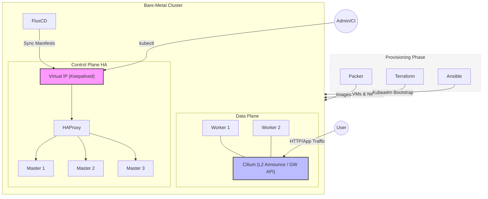

# k8s-infrastructure

Kubernetes Bare-Metal Infrastructure provisioning and management (IaC, High Availability, Immutable Infrastructure)

## 🧩 The Ecosystem
This project is part of a distributed GitOps architecture across several repositories:
* **Infrastructure (This Repo):** Bare-metal provisioning with Terraform, Ansible, and Packer.
* **[GitOps Config](https://github.com/winterlyembrace/k8s-gitops-config):** Cluster state, FluxCD manifests, and Helm releases.
* **[CI Tooling](https://github.com/winterlyembrace/ci-toolkit)**: Optimized build images (Kaniko, Trivy).
* **[Demo Application](https://github.com/winterlyembrace/chpod)**: The source code for the Full-stack App (Python + React).

This repository contains a complete Infrastructure as Code (IaC) and Gitlab CI workflow to provision and manage a highly available multi-node Kubernetes cluster from scratch on Libvirt/KVM virtual machines.

The project covers everything from machine image creation to application deployment via GitOps, ensuring a fully automated "zero-to-cluster" experience.

🚀 Project Architecture

The deployment is split into three main phases:

Image Provisioning (Packer)

Packer is used to build optimized Debian/Ubuntu images.

Pre-installed dependencies: kubeadm, kubelet and container runtime (containerd).

Ensures consistent environments across all nodes and speeds up cluster bootstrapping.

Infrastructure & Bootstrapping (Terraform & Ansible)

Terraform: Provisions the underlying virtual infrastructure (virtual machines, networking, storage).

Ansible: Configures HAProxy and Keepalived to provide a High Availability Control Plane consisting of 3 master nodes. Executes kubeadm init and joins worker nodes. Deploys Cilium as the CNI for high-performance networking and security.

GitLab CI: Orchestrates the entire flow, from Terraform plan/apply to Ansible playbooks.

GitOps & Application Layer (FluxCD)

Once the cluster is live, FluxCD from another repository (https://github.com/winterlyembrace/k8s-gitops-config) takes over to manage cluster state:

Cilium L2 Announcement: Configured for local network accessibility.

Workloads: Automatic deployment of a full-stack application (Frontend + Backend).

Modern Ingress: Implemented via Cilium Gateway API (HTTPRoute) for advanced L7 traffic management and service exposure.

Synchronization: Ensures the cluster state always matches the configuration in the Git repository.

🛠 Tech Stack

IaC: Terraform, Packer

Configuration Management: Ansible

Orchestration: Kubernetes (kubeadm)

Networking: Cilium (CNI), HAProxy, Keepalived, Gateway API

CI/CD: GitLab CI, FluxCD

Platform: KVM/libvirt (Bare-Metal)

🗺 Roadmap & Future Enhancements

[ ] Pure GitOps Infrastructure: Migrate from GitLab CI/Ansible to a Tofu-controller (OpenTofu) managed from a dedicated Management Cluster.

[ ] Observability: Integrate Prometheus and Grafana for full-stack monitoring and alerting.

[ ] Secret Management: Implement HashiCorp Vault to Management Cluster for secure injection of credentials and certificates.

[ ] Automated Scaling: Explore Cluster Autoscaler integration for bare-metal providers. 